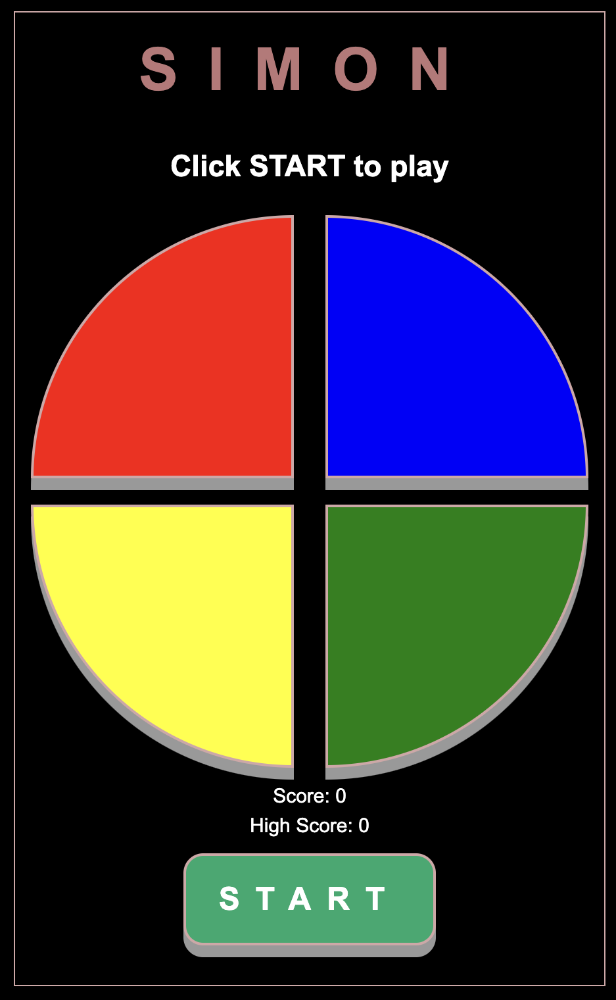
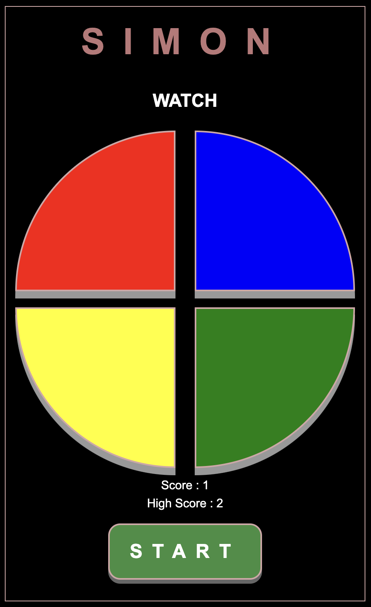
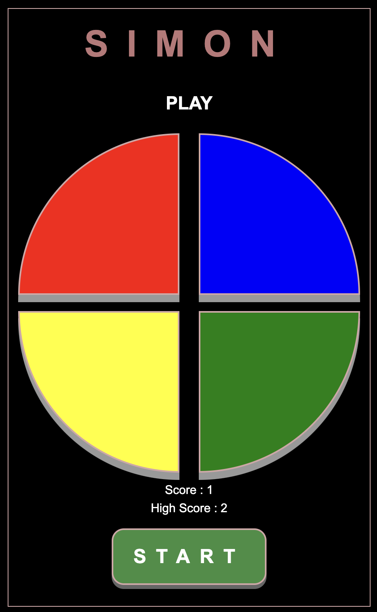
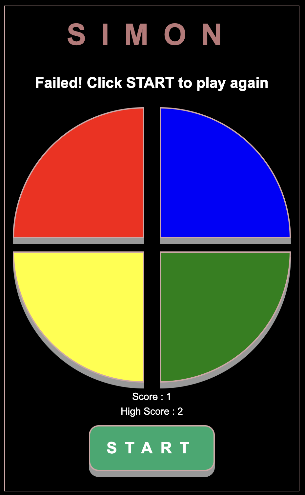

Simon Game:
Test your memory and remember the pattern of lights and sounds. It is a memory game where you have to follow the sequence and copy the sequence correctly to move on to the next level.When a coloured button flashes, you click on the button. When you get futher on in the game you will have several colours to rememeber in order. The game gets harder the longer you play!How far can you get?

History:[source-wikipedia]
Simon is an electronic game of short-term memory skill invented by Ralph H. Baer and Howard J. Morrison, working for toy design firm Marvin Glass and Associates,[1] with software programming by Lenny Cope. The device creates a series of tones and lights and requires a user to repeat the sequence.
The device has four colored buttons, each producing a particular tone when it is pressed or activated by the device. A round in the game consists of the device lighting up one or more buttons in a random order, after which the player must reproduce that order by pressing the buttons. As the game progresses, the number of buttons to be pressed increases.

Screenshots: 

Technologies:
1 HTML - For the front end elements and design of the game.
2 CSS - For styling the game user interface.
    2.1 W3.CSS - Used for styles and blink animation
3 javascript - For implementing core logic of the game.

Getting Started:
https://priyankanair1.github.io/SimonGame/
*Follow the instructions on the board!

Next Steps: For future enhancements will be adding different modes to play like - easy,medium,hard. Add 2 more choices of color to add complexity of game.
